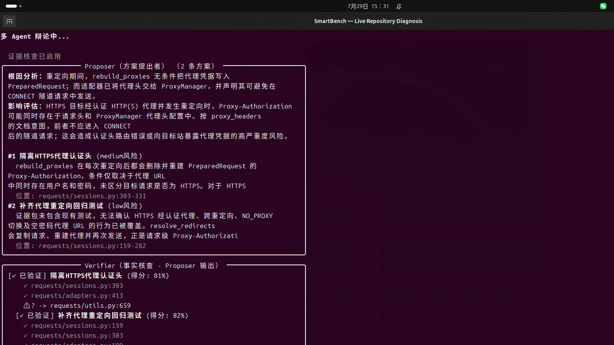

# SmartBench

[](https://github.com/xianyu-sheng/SmartBench/actions/workflows/ci.yml)
[](https://www.python.org/)
[](CHANGELOG.md)
[](#项目状态)
[](LICENSE)

SmartBench 是一个实验性的代码诊断工作台：用规范化静态分析提供事实，用受证据约束的 LLM 完成项目语义解释与交叉审查。

[English](README.md) · [实战演示](https://xianyu-sheng.github.io/SmartBench/) · [架构文档](docs/ARCHITECTURE.md) · [使用指南](docs/USAGE_GUIDE.md)

[](https://xianyu-sheng.github.io/SmartBench/)

常规流程只读。SmartBench 不会自动修改目标仓库、创建 Issue/PR 或联系维护者。

> [!IMPORTANT]
> SmartBench 当前是公开 Beta，不是生产级 SAST 替代品。它可以用于受控仓库审计，并能复现一小组已知历史缺陷；目前没有证明通用未知 Bug 的 precision 或 recall。

## SmartBench 正在验证什么

SmartBench 探索的是代码诊断中的一种职责划分：

- 语言前端和确定性分析器拥有源码事实的解释权；
- LLM 可以把项目特有约定或风险作为 hypothesis 提出；
- resolver 和 validator 决定 hypothesis 能否重新绑定到真实 operation、类型与控制流；
- 证据不足的结论保留为 `unknown` 或 `abstained`，不能升级为 finding。

当某种项目约定过于局部、不值得写成一条语言级规则，而直接允许模型宣称 Bug
又缺乏可信边界时，这种分工才有价值。

当前仓库实际提供的能力是：

| 路径 | 当前输出 | 不能据此证明什么 |
| --- | --- | --- |
| 确定性 `unified` 分析 | 规则 finding、capability、源码角色、图事实、JSON 和 SARIF | 干净结果不代表代码没有 Bug |
| 配置模型后的 `quick` | 项目 hypothesis、受 evidence gate 约束的审查、明确拒绝和 abstain 状态 | Agent 引用了真实 fact，不等于结论已经成立 |
| 公开 before/after corpus | 可复现地验证部分 analyzer 能区分六个已知修复 | 对未知 Bug 的 precision 或 recall |

目前更适合的使用者，是评估这套架构或进行受控、人工复核仓库审计的人；它还不是
可以直接放进 CI 作为质量门禁的工具。

## 快速开始

要求 Python 3.10+ 和 Git。

```bash
git clone https://github.com/xianyu-sheng/SmartBench.git
cd SmartBench
python -m venv .venv
source .venv/bin/activate
python -m pip install -e ".[graph]"
```

不使用 LLM，运行确定性分析：

```bash
smartbench unified run \
  --project /path/to/repository \
  --output report.json \
  --sarif report.sarif
```

运行交互式证据与 Agent 链路：

```bash
export DEEPSEEK_API_KEY="your-key"
smartbench quick \
  --project /path/to/repository \
  --concern "检查正确性与资源生命周期风险" \
  --output agent-report.json
```

本地向量检索是可选能力：

```bash
python -m pip install -e ".[graph,rag]"
```

不安装 `rag` 时仍会运行确定性图检索，只跳过本地向量索引。

## 运行时架构

主要 CLI 入口现在共享同一个 `AnalysisSession`。仓库发现、语言降低、SemanticIR 构建和 SemanticLinker 只运行一次；确定性规则、检索、ProjectReader 和多 Agent 都消费同一份结果。

```text
Repository
  -> ScanPlan -> language frontends -> SemanticIR -> SemanticLinker
  -> AnalysisSession
       |-> 确定性规则与声明式状态分析
       |-> 确定性 GraphRAG
       |-> ProjectReader hypothesis
             -> evidence resolver -> validator -> CFG lifecycle analyzer
       `-> EvidencePack { facts, hypotheses, source references }
             -> Proposer -> source verifier -> Critique -> Judge
  -> JSON / SARIF / benchmark report
```

系统仍有不同消费者，但它们不再各自重建不兼容的 IR：

| 命令 | 是否使用共享会话 | LLM 行为 |
| --- | --- | --- |
| `smartbench unified run` | 是 | 默认不使用 LLM，只运行确定性规则 |
| `smartbench quick` / 交互向导 | 是 | 可选 ProjectReader 与受证据约束的多 Agent 审查 |
| `smartbench benchmark run` | 是 | 不使用 LLM，运行固定快照与预期 |
| `smartbench eval-rag` | 是 | 不使用 LLM，评测会话 IR 上的检索 |
| `smartbench diagnose` | 不是代码语义入口 | 运行本地编译器、进程与工具探针 |

旧的 `CodeGraph -> SemanticIR.from_graph` 包装仍为库兼容和 fallback 保留，但主要 CLI 已不再用浅层兼容 IR 代替完整语言前端。

## 证据边界

`EvidencePack` 明确区分两类输入：

- `facts`：来自源码图或确定性分析器、具有稳定 `fact-*` ID 的事实；
- `hypotheses`：ProjectReader 解释和启发式规则候选，使用 `hypothesis-*` ID。

后续 Agent 可以读取 hypothesis 来决定“查什么”，但 evidence gate 不会把它当作 fact。最终具体结论必须引用合法 fact ID；缺失、歧义、冲突或所有权不明时保留为 `unknown` 或 `abstained`。

当前 debate gate 校验的是 fact ID 是否存在，不是“该事实是否在逻辑上蕴含这条
结论”。模型仍可能引用一个真实但不支持结论的 fact。因此，源码位置核验、
ProjectReader 的确定性验证和人工复核是彼此独立的要求；typed
conclusion-to-evidence relation 仍是待完成的契约。

ProjectReader 不能写入 SemanticIR。当前资源生命周期链路中，它只能选择真实 CALL 并提出项目级清理协议，随后由程序：

1. 绑定真实 operation、cleanup fact 与 TypeEvidence；
2. 对零匹配或多匹配拒绝；
3. 校验 result binding、member path、可达性和类型选择；
4. 运行语言无关 CFG dominance 检查；
5. 产生 finding，或明确 abstain。

只有在确定性拒绝后才允许一次 bounded repair。repair 只能看到同一 inventory 和拒绝原因，看不到 analyzer 答案。

## 语言支持

| 语言 | 当前层级 | 边界 |
| --- | --- | --- |
| Python | 深层语义 | CFG/ICFG、调用、状态规则，部分类型和数据语义 |
| Go | 深层语义 | CFG/ICFG、状态/资源分析和表层 TypeEvidence；没有 `go/types` |
| JavaScript / TypeScript | 部分语义 | 公共语句、调用与控制流；异步、异常和动态分派仍为 partial |
| Rust | 结构级 | tree-sitter 符号与图上下文，没有完整语义降低 |
| Java、Kotlin、C/C++、Ruby、Swift、C#、Zig | 识别/启发式 | 项目指纹和回退结构，不是编译器级分析 |

语言无关 analyzer 不导入具体语言 parser。新增语义前端必须提供稳定源码位置、显式 capability、确定性 IR 序列化和至少一个 before/after benchmark。

## 如何阅读报告

`unified` 报告包含 findings、capability assessment、source role、repository zone、SemanticIR 统计、错误和有界 EvidencePack。`quick` 会把同一份确定性结果放在 `analysis_report`，与 Agent 审查一起输出。

| 状态 | 含义 |
| --- | --- |
| `full` | 相关前端满足该规则声明的全部要求 |
| `partial` | 运行了有文档边界的近似分析 |
| `unsupported` | 缺少必要语义，不能当成干净结果 |
| `unknown` | 规则没有声明足够语义要求，无法声称覆盖 |
| `abstained` | 证据缺失、歧义、冲突或可能存在 ownership transfer |

还需要注意：

- verifier 的 `verified`、`hallucinated` 描述的是源码位置和结构引用是否成立，不证明 Bug 结论正确；
- `consensus_reached` 当前表示 Proposer、Critique、Judge 三个阶段都返回了 schema
  合法的输出；它是阶段完成标记，不是多个独立模型的统计一致率；
- Critique 或 Judge 失败时，Proposer 或 Judge 输出只会保存在
  `unreviewed_suggestions` 供审计，不会升级为 `final_suggestions`。控制台会明确
  显示 review 未完成，而不是把它报告成干净结果。

## 可复现实验

仓库包含六个来自公开修复的 before/after 案例，共 12 个最小源码快照。这些 fixture
保留声明式 analyzer 所需的代码，并不是六个历史仓库的完整 checkout：

| 项目 | 语言 | 公开修复 | 类别 |
| --- | --- | --- | --- |
| Requests | Python | [GHSA-j8r2-6x86-q33q](https://github.com/advisories/GHSA-j8r2-6x86-q33q) | 安全状态 guard |
| FastAPI | Python | [#5465](https://github.com/fastapi/fastapi/pull/5465) | 资源生命周期 |
| Prometheus | Go | [#1070](https://github.com/prometheus/prometheus/pull/1070) | 资源生命周期 |
| Kubernetes | Go | [#29495](https://github.com/kubernetes/kubernetes/pull/29495) | 资源生命周期 |
| Gin | Go | [#4422](https://github.com/gin-gonic/gin/pull/4422) | 资源生命周期 |
| Terraform | Go | [#38585](https://github.com/hashicorp/terraform/pull/38585) | 资源生命周期 |

```bash
smartbench benchmark run \
  --manifest benchmarks/real/manifest.yaml \
  --output benchmark-report.json
```

当前预期是 12/12 快照检查通过：声明的缺陷快照产生对应规则，修复快照不产生。它证明 SmartBench 能表达这些已知缺陷，不测量未知 Bug recall。

独立 blind ProjectReader 实验会从模型 inventory 中排除历史目标文件。一次已记录的 DeepSeek A/B 在两个具有合法 reference 的 Go 协议上完成 6/6 trials；另外两个案例因 reference 不成立保持 unsupported。完整边界见 [实验说明](benchmarks/experiments/project_reader_blind/README.md)。

## 已知限制

- 大多数内置规则仍是源码启发式；声明式状态规则和资源生命周期 analyzer 是目前最强的语义案例。
- 异常流、异步调度、动态分派、别名分析、goroutine happens-before 和跨函数 channel alias 尚不完整。
- ProjectReader 生命周期 analyzer 当前只证明规范化的 defer-style cleanup。
- benchmark 规模小，且资源生命周期类别占比过高。
- 大型仓库的延迟和内存还没有公开、稳定的预算。
- 本地向量/TF-IDF 缓存还不能跨所有可选依赖变化稳定复用；如果缓存是在安装
  scikit-learn 时生成、之后又在缺少它的环境中打开，需要删除目标仓库的
  `.smartbench/` 缓存后重建。
- `quick` 发送的仓库内容对所配置的远程模型供应商可见。
- 干净报告可能表示“没有受支持的 finding”，不等于“仓库没有 Bug”。

## 安全边界

- 源码路径被限制在仓库根目录内，外部 symlink 和 `../` 越界会被忽略。
- 外部命令不通过 shell，并带有时间和输出上限。
- 可选 `quick --sandbox` 只在临时副本中应用 patch，但测试仍拥有当前用户的系统权限。
- 除非允许发送给远程 provider，否则不要分析包含秘密或受限源码的仓库。
- 未经多次验证和人工决策，不应把 SmartBench finding 提交给上游项目。

## 文档与开发

- [架构文档](docs/ARCHITECTURE.md)
- [使用指南](docs/USAGE_GUIDE.md)
- [演示时间线](docs/DEMO_3_MINUTES_CN.md)
- [证据闭环说明](docs/EVIDENCE_LOOP_ARTICLE_CN.md)
- [历史 benchmark](benchmarks/real/README.md)
- [Blind ProjectReader 实验](benchmarks/experiments/project_reader_blind/README.md)

```bash
python -m pip install -e ".[dev,graph]"
ruff check smartbench tests
pytest -q
python -m compileall -q smartbench
python -m build
```

CI 运行 Python 3.10-3.12 测试、parser adapter 检查、12 快照 benchmark、ProjectReader 边界实验和干净 wheel CLI 冒烟。

## 项目状态

SmartBench 适合受控仓库实验、架构研究和项目展示。下一步更有价值的是效果度量，而不是继续堆表层功能：

1. 把 corpus 扩展到 10-20 个外部 before/after 和自然负样本；
2. 增加另一类 Agent-derived protocol 和另一个语义语言案例；
3. 公开 precision、recall、abstention rate、trial stability、延迟和成本；
4. 在不削弱 IR 边界的前提下深化异常、异步、类型、别名和并发语义。

## 许可证

[MIT](LICENSE)
